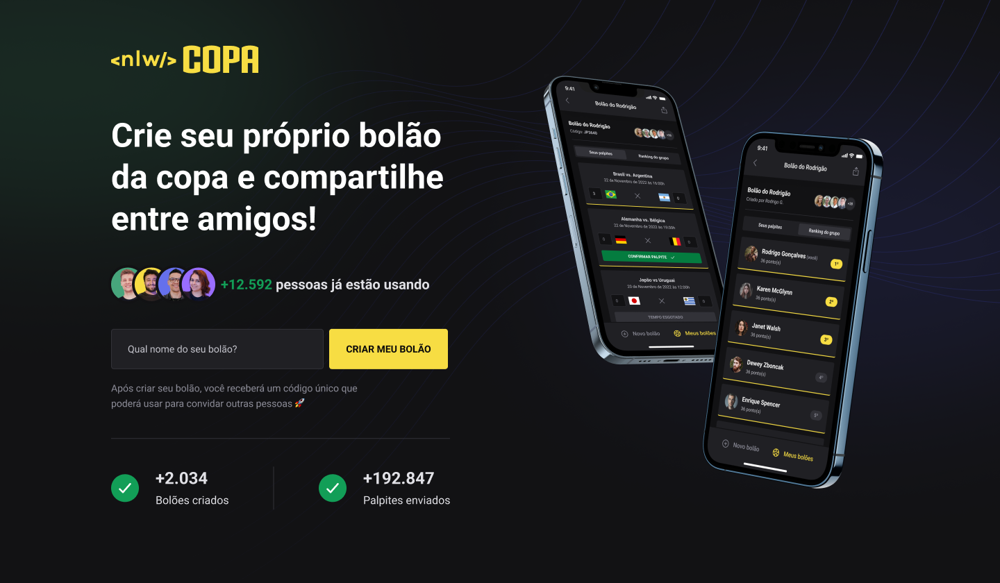

   

 

 

[**Sobre**](#-sobre) &nbsp;&nbsp;**|**&nbsp;&nbsp;
[**Features**](#-features) &nbsp;&nbsp;**|**&nbsp;&nbsp;
[**Tecnologias e ferramentas utilizadas**](#-tecnologias-e-ferramentas-utilizadas) &nbsp;&nbsp;**|**&nbsp;&nbsp;
[**Layout**](#-layout) &nbsp;&nbsp;**|**&nbsp;&nbsp;

## 📃 Sobre

**NLW Copa** é o projeto desenvolvido durante a trilha Ignite da **Next Level Week**, um evento online produzido pela [**Rocketseat**](https://github.com/Rocketseat).

O projeto consiste em uma aplicação com a temática da copa, que permitirá os usuários criarem seus próprios bolões da copa e compartilhá-los com seus amigos.

## ✨ Features

### Back-end

- [x] Criação de um bolão
- [x] Contagem de bolões, usuários e palpites cadastrados
- [x] Schema validation utilizando o Zod
- [x] Diagrama ERD (entidade-relacionamento):

### Front-end (Web)

- [x] Criação de um bolão
- [x] Exibição da quantidade de usuários, bolões, e palpites criados

### Mobile

🚧 Em desenvolvimento 🚧

## 🚀 Tecnologias e ferramentas utilizadas

<table>
  <tbody>
    <tr>
      <td style="font-weight: bold">Back-end</td>
      <td>
        <a href="https://nodejs.org/en/" target="_blank" rel="noopener noreferrer">NodeJs</a>,
        <a href="https://www.typescriptlang.org/" target="_blank" rel="noopener noreferrer">Typescript</a>,
        <a href="https://www.prisma.io/" target="_blank" rel="noopener noreferrer">Prisma</a>,
        <a href="https://www.fastify.io/" target="_blank" rel="noopener noreferrer">Fastify</a>,
        <a href="https://zod.dev/" target="_blank" rel="noopener noreferrer">Zod</a>,
        <a href="https://www.sqlite.org/index.html" target="_blank" rel="noopener noreferrer">SQLite</a>
      </td>
    </tr>
    <tr>
      <td style="font-weight: bold">Front-end (web)</td>
      <td>
        <a href="https://reactjs.org/" target="_blank" rel="noopener noreferrer">React</a>,
        <a href="https://www.typescriptlang.org/" target="_blank" rel="noopener noreferrer">TypeScript</a>,
        <a href="https://nextjs.org/" target="_blank" rel="noopener noreferrer">NextJS</a>,
        <a href="https://tailwindcss.com/" target="_blank" rel="noopener noreferrer">TailwindCSS</a>,
        <a href="https://axios-http.com/docs/intro" target="_blank" rel="noopener noreferrer">Axios</a>
      </td>
    </tr>
    <tr>
      <td style="font-weight: bold">Mobile</td>
      <td>
        <a href="https://reactnative.dev/" target="_blank" rel="noopener noreferrer">React Native</a>,
        <a href="https://expo.dev/" target="_blank" rel="noopener noreferrer">Expo</a>,
        <a href="https://nativebase.io/" target="_blank" rel="noopener noreferrer">Native Base</a>
      </td>
    </tr>
  </tbody>
</table>

## 📟 Layout

O layout das telas da aplicação **NLW Copa** foi desenvolvido pela equipe da **Rocketseat** através da ferramenta [**Figma**](https://www.figma.com).
Você pode acessar o layout através deste link: [**NLW Copa**](https://www.figma.com/community/file/1169028343875283461).
